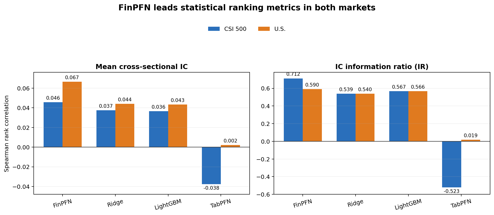
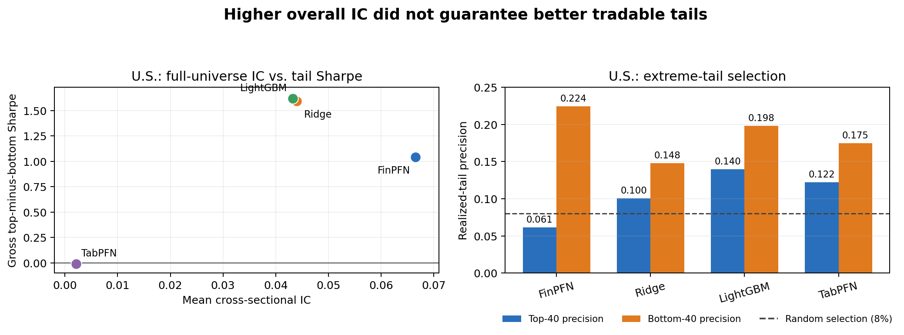

# FinPFN Reproduction and Model-Risk Audit

Frozen portfolio release: `v1.0-reproduction-audit`

**Research question:** Does FinPFN's stronger cross-sectional ranking accuracy
translate into better tradable long-short portfolios across China and U.S.
equities?

## Results

All models use the same asset-date universe and raw-return target within each
market. Sharpe is calculated from the actual top-minus-bottom return series.
CSI 500 has 301 daily test dates; the U.S. sample has 143 monthly test dates.

| Market | Model | Mean IC | IR | Gross H-L Sharpe | Net H-L Sharpe (10 bps) |
|---|---|---:|---:|---:|---:|
| CSI 500 | **FinPFN** | **0.0456** | **0.712** | 4.384 | -0.900 |
| CSI 500 | Ridge | 0.0374 | 0.539 | **4.889** | **1.035** |
| CSI 500 | LightGBM | 0.0364 | 0.567 | 4.810 | 0.686 |
| CSI 500 | TabPFN | -0.0378 | -0.523 | -5.193 | -10.097 |
| U.S. | **FinPFN** | **0.0665** | **0.590** | 1.040 | 0.901 |
| U.S. | Ridge | 0.0439 | 0.540 | 1.592 | 1.426 |
| U.S. | LightGBM | 0.0432 | 0.566 | **1.620** | **1.473** |
| U.S. | TabPFN | 0.0021 | 0.019 | -0.009 | -0.148 |





## Findings

1. **FinPFN leads statistical ranking metrics, but only partially reproduces
   the paper.** It has the highest common-universe IC/IR in both markets; the
   literal CSI notebook protocol produces IR 0.797 versus approximately 0.85
   reported by the authors.
2. **Higher IC does not produce the strongest portfolio.** Ridge and LightGBM
   have higher gross long-short Sharpe in both markets. At 10 bps per unit of
   one-way turnover, FinPFN's CSI net Sharpe falls below zero.
3. **The gap is concentrated in tails and stability.** FinPFN improves broad
   cross-sectional ordering but has weaker extreme-long precision and lower
   rank persistence. Uncertainty gating did not improve validation net Sharpe,
   and a validation-selected rank buffer failed its one-shot test.

## Verify or reproduce

The data-free release checks run locally in under a minute:

```bash
python3 reproduction/tests/verify_release.py
```

Full reproduction requires separately licensed datasets and released
checkpoints:

```bash
python -m venv .venv
. .venv/bin/activate
python -m pip install -r reproduction/environment/requirements-cpu-lock.txt
python reproduction/scripts/preflight.py --mode full
```

See [REPRODUCIBILITY.md](reproduction/REPRODUCIBILITY.md) for the CPU baseline,
single-GPU checkpoint, evaluation, and analysis commands. Asset locations and
SHA-256 values are in [ASSETS.md](reproduction/ASSETS.md).

## Limitations

- This is a released-checkpoint reproduction and model-risk audit, not FinPFN
  retraining. The exact published CSI prediction artifact cannot be regenerated
  from the visible notebook because its sampling behavior differs from the
  artifact.
- Point-in-time feature construction and forward-return alignment cannot be
  independently verified from the final parquet panels.
- The U.S. protocol resamples a 500-stock universe each month, so reported
  turnover is not a live full-universe deployment estimate.
- Linear costs omit impact, borrowing, financing, capacity, price limits, and
  execution delay. Post-test mechanism analysis is exploratory.

The [full report](reproduction/REPORT.md) documents methods, negative findings,
integrity checks, hardware, runtimes, and all deviations. The upstream BSD
3-Clause license and attribution are preserved in
[UPSTREAM_ATTRIBUTION.md](UPSTREAM_ATTRIBUTION.md).
